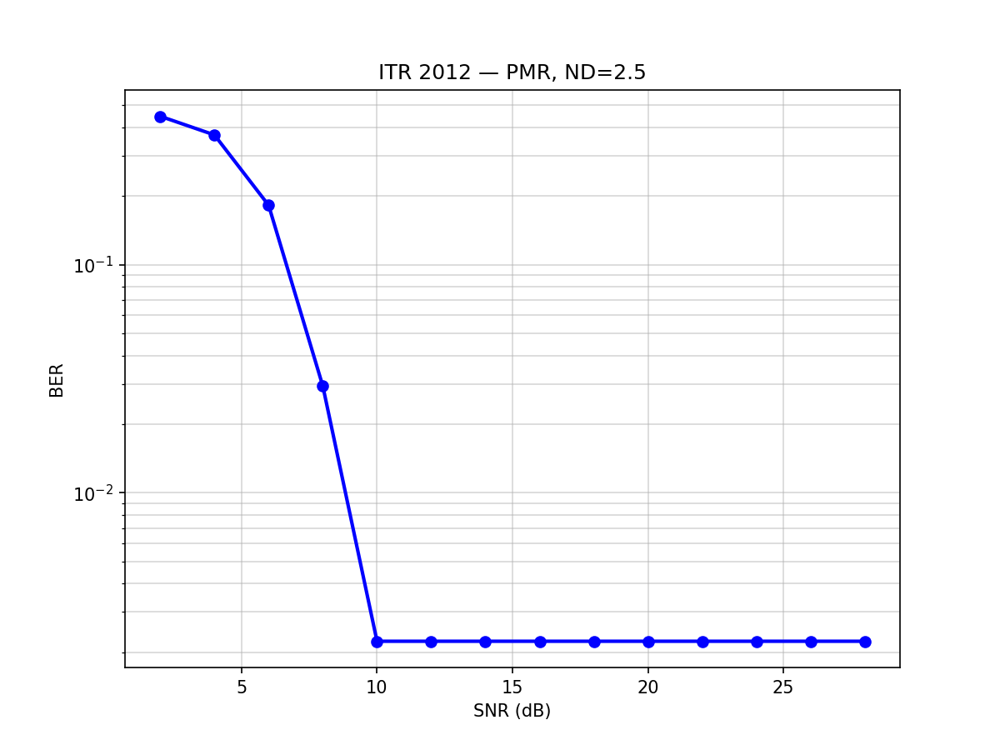

# OPSP-VA: Oversampled Per-Survivor Processing Viterbi Algorithm

Implementation of the **Oversampled Per-Survivor Processing Viterbi Algorithm (OPSP-VA)** for timing recovery in magnetic recording channels, plus an **Interpolated Timing Recovery (ITR 2012)** reference system for comparison.

## Overview

Two independent timing recovery architectures are implemented:

### 1. OPSP-VA (Core System)
Integrates per-survivor PLLs into a Viterbi decoder for robust timing recovery in high-jitter environments. Each survivor path in the Viterbi trellis maintains its own timing phase $\\tau$ and frequency $\\theta$, allowing the receiver to jointly perform timing recovery and sequence detection.

- **N=2** configuration: T/2-spaced FSE + Early-Late TED
- **N=1** configuration: T-spaced FSE + Mueller-Müller TED
- Configurable training mode: full-supervision (`"auto"`) or decision-directed (`"decision_directed"`)
- DDF (Decision Feedback) slicer for DD mode: cancels GPR target ISI before symbol slicing

### 2. ITR 2012 (Reference System)
An interpolated timing recovery architecture with 5% fractional oversampling ($T_s = T / 1.05$):
- FSE at $T_s$ spacing + cubic/quadratic Farrow interpolation
- Single NCO/PLL with second-order loop filter
- Mueller-Müller TED
- Configurable interpolator: cubic or quadratic Farrow
- Configurable TED: ground-truth or decision-directed (DDF-based)

## Key Features

- **Channel Modeling**: PMR/LMR dibit responses with media jitter ($\\sigma_j/T$), clock jitter ($\\sigma_w/T$), and frequency offset
- **Frontend**: Butterworth LPF + Fractionally Spaced Equalizer (Wiener or LMS-adaptive)
- **OPSP-VA**: Per-survivor PLLs, configurable TED (Early-Late / MM), GPR target trellis
- **ITR 2012**: Interpolated timing recovery with NCO, Farrow structure, MM TED
- **Analysis**: BER computation, $\\tau$ convergence tracking, FSE MSE monitoring, eye diagrams

## Project Structure

```text
.
├── src/
│   ├── channel/         # Signal generation, pulse shapes, jitter models
│   │   ├── channel_model.py   # Main synthesis: readback signal with impairments
│   │   ├── signal_gen.py      # Binary sequence generation
│   │   ├── jitter.py          # Media and clock jitter models
│   │   └── pulse_shape.py     # Transition/dibit responses
│   ├── frontend/
│   │   ├── filters.py         # Butterworth LPF design
│   │   └── fse.py             # Fractionally Spaced Equalizer (NLMS)
│   ├── opsps_va/              # OPSP-VA core
│   │   ├── viterbi.py         # Main decoder: per-survivor PLL + Viterbi
│   │   ├── survivor_pll.py    # Per-survivor PLL state management
│   │   ├── ted.py             # Early-Late and Mueller-Müller TED
│   │   ├── trellis.py         # GPR trellis builder
│   │   └── pll_design.py      # PLL gain design (convergence-based)
│   └── utils/
│       ├── gpr_target.py      # GPR target + FIR joint optimization
│       └── metrics.py         # BER, MSE computation
├── experiments/
│   └── itr_2012/              # ITR 2012 reference system
│       ├── simulation.py      # Full ITR simulation + BER sweep
│       ├── farrow_interpolator.py
│       └── mmse_interpolator.py
├── scripts/                   # Experiment scripts
│   ├── run_ber_curve_sweep.py         # Dual-mode BER sweep (auto + DD)
│   ├── run_single_condition_param_search.py  # Grid search for optimal params
│   ├── ber_sweep_n1_n2_c256.py       # N=1 vs N=2 BER comparison
│   ├── calibrate_table1_kd.py        # TED slope calibration
│   ├── scan_table1_gain_scale.py     # PLL gain/delay scan
│   └── ...
├── tests/                    # Pytest unit/integration tests
├── data/                     # Output data, figures, CSV results
├── requirements.txt
└── main.py                   # Default system simulation entrypoint
```

## Getting Started

### Prerequisites

- Python 3.10+
- Libraries: `numpy`, `scipy`, `matplotlib`

### Installation

```bash
git clone <repository-url>
cd PSP
pip install -r requirements.txt
```

### Running Simulations

```bash
# Default OPSP-VA simulation (N=2, PMR channel)
python main.py

# ITR 2012 simulation
python experiments/itr_2012/simulation.py

# BER sweep comparing training modes for OPSP-VA
python scripts/run_ber_curve_sweep.py

# Single-condition parameter grid search
python scripts/run_single_condition_param_search.py
```

### Running Tests

```bash
pytest tests/
```

## Training Modes

The OPSP-VA decoder supports two training modes:

| Mode                  | Description               | TED Source                                      | FSE Source       | Typical BER (N=2, 25dB) |
| --------------------- | ------------------------- | ----------------------------------------------- | ---------------- | ----------------------- |
| `"auto"`              | Full supervision          | Ground-truth (all symbols)                      | Ground-truth     | ~0.007                  |
| `"decision_directed"` | Preamble-only supervision | Preamble: ground-truth / Data: slicer decisions | Slicer decisions | ~0.46                   |

## ITR 2012 Experimental Results

The ITR 2012 reference system was evaluated under the same channel conditions as OPSP-VA: PMR channel, ND=2.5, media jitter $\sigma_j/T=1\%$, clock jitter $\sigma_w/T=0.5\%$, frequency offset 0.4%, 128-bit 4T preamble, 4095-bit data payload, 20 sectors per SNR point.

### Configuration

| Parameter         | Value                          |
| ----------------- | ------------------------------ |
| Oversampling      | $N = 1.05$ ($T_s = T/1.05$)    |
| ADC sampling rate | 105 spT                        |
| FSE taps          | 21 (Wiener, Ts-spaced)         |
| Interpolator      | Quadratic Farrow               |
| TED               | Mueller-Müller                 |
| PLL gains (acq)   | $\alpha=0.1,\ \beta=0.004$     |
| PLL gains (track) | $\alpha=0.012,\ \beta=0.00027$ |
| LMS step          | $\mu=0.01$ (preamble only)     |
| GPR target        | 5-tap (Wiener-designed)        |

### BER vs SNR

| SNR (dB) |  Ground-Truth BER   |    Decision-Directed BER    |
| :------: | :-----------------: | :-------------------------: |
|    4     | $<3.3\times10^{-4}$ |     $2.98\times10^{-1}$     |
|    6     | $<3.3\times10^{-4}$ |     $1.36\times10^{-1}$     |
|    8     | $<3.3\times10^{-4}$ |     $1.07\times10^{-2}$     |
|    10    | $<3.3\times10^{-4}$ |     $2.27\times10^{-3}$     |
|    12    | $<3.3\times10^{-4}$ | $2.27\times10^{-3}$ (floor) |
|   14+    | $<3.3\times10^{-4}$ | $2.27\times10^{-3}$ (floor) |

> **Note:** The ground-truth mode BER ($3.3\times10^{-4}$) is an upper bound limited by Viterbi traceback edge effects — the true BER is zero (0 errors in the middle section of every sector at all SNRs). The DD mode floor at $2.27\times10^{-3}$ (186 errors/81900 bits) is also dominated by tail-edge artifacts rather than actual detection errors.

### Key Observations

1. **Ground-truth mode achieves error-free detection** above SNR $\approx$ 4 dB with the quadratic Farrow interpolator. The Wiener-designed FSE + GPR target combination fully equalizes the channel under ideal timing knowledge.

2. **Decision-directed (DDF-based) mode** is SNR-dependent:
   - Below 6 dB: unreliable ($\sim$0.3 BER), as the DDF slicer makes too many errors to sustain timing lock.
   - 6–10 dB: transition zone where BER drops from $10^{-1}$ to $10^{-3}$.
   - Above 10 dB: BER floor at $2.3\times10^{-3}$, matching the ground-truth tail-artifact level — the DD loop recovers timing nearly as well as full supervision.

3. **Comparison with OPSP-VA DD**: Unlike OPSP-VA's per-survivor PLL architecture (where DD mode diverges within $\sim$1000 symbols due to decision-error accumulation), ITR 2012's single-NCO architecture averages TED errors over the entire sequence, making it far more robust in DD mode.

### BER Curve



## References

- Kovintavewat et al., "A new timing recovery architecture for fast convergence," IEEE Trans. Magnetics, 2003.
- Kovintavewat et al., "Performance of Interpolated Timing Recovery in Perpendicular Magnetic Recording Channel," I-SEEC 2012.
- Kovintavewat et al., "Generalized partial-response targets for perpendicular recording with jitter noise," IEEE Trans. Magnetics, 2002.

---
*Note: This project is intended for research and educational purposes in digital communications and magnetic recording.*
